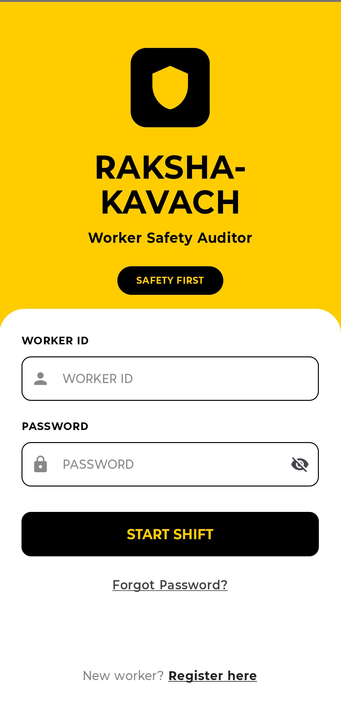
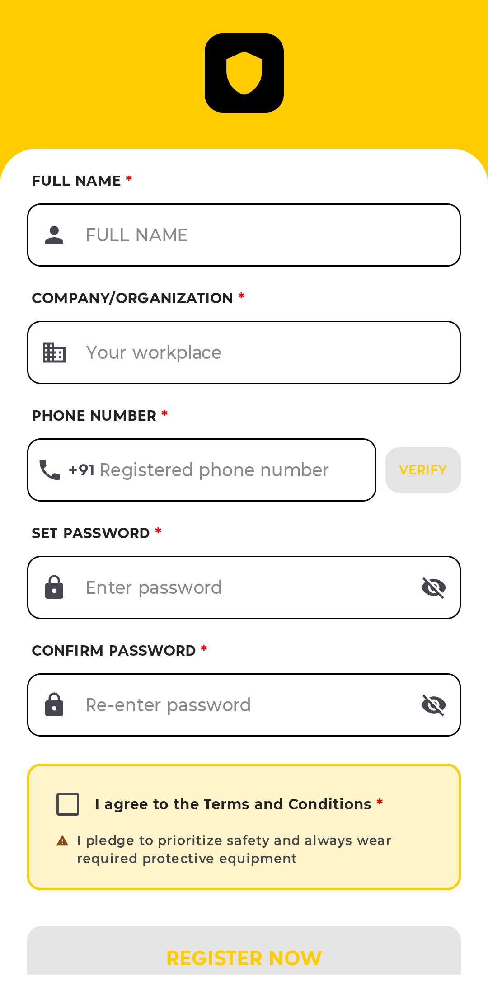
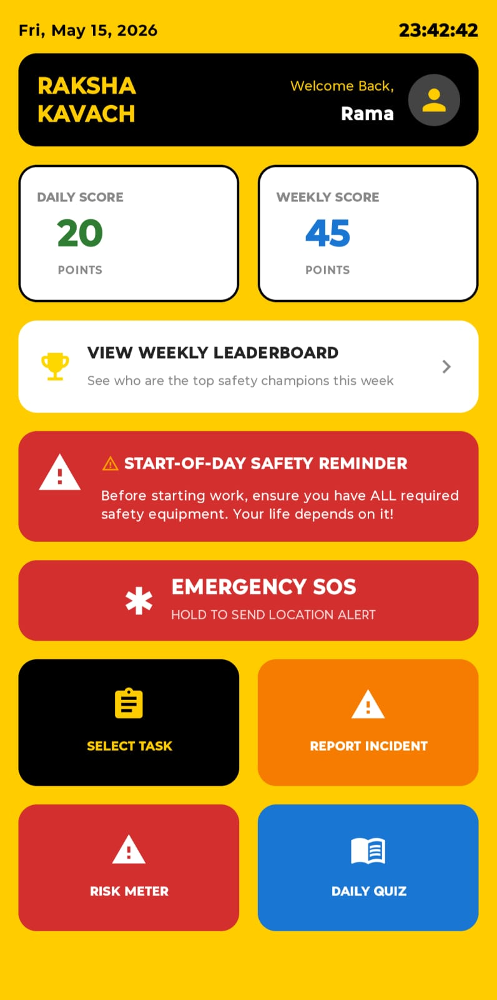
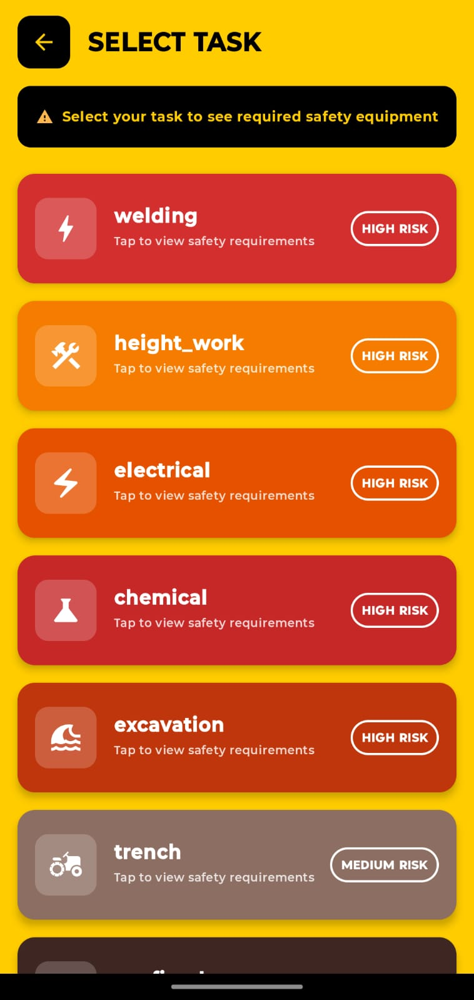
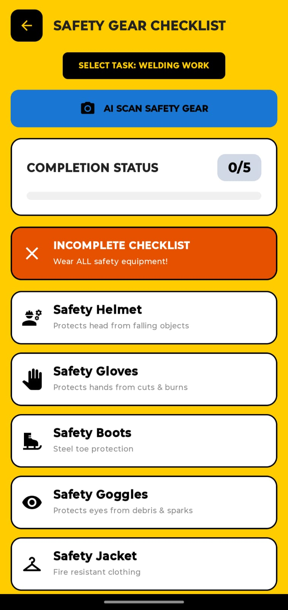
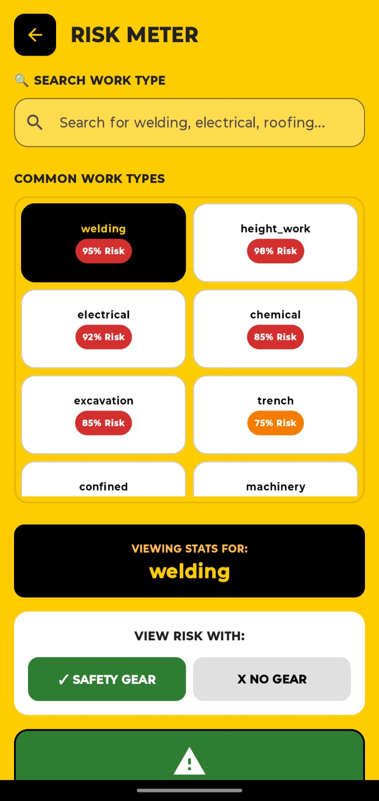
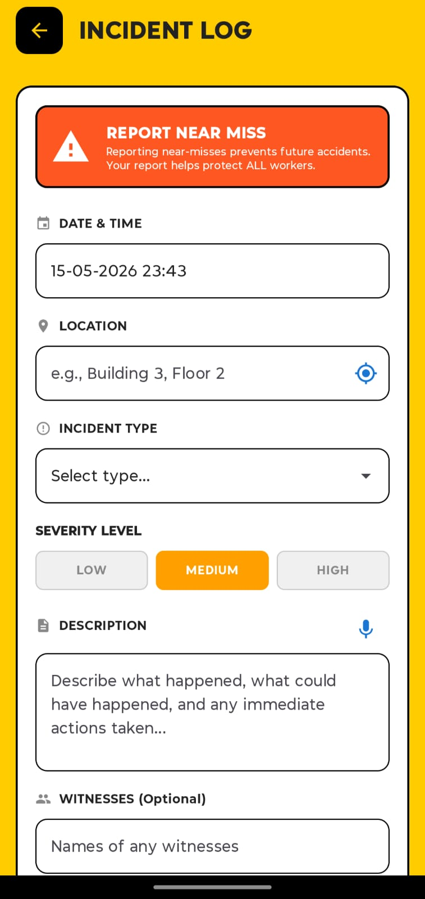
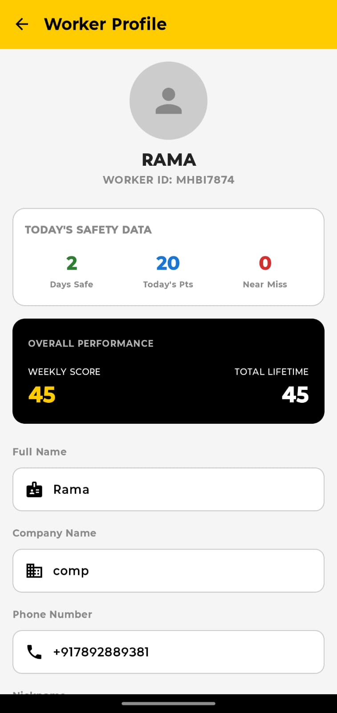

# 🛡️ Raksha Kavach (Safety Shield)
**AI-Powered Industrial Worker Safety Auditor & SOS System**

Raksha Kavach is a native Android application designed to modernize workplace safety in industrial environments. Built with **Kotlin** and **Jetpack Compose**, it leverages **Generative AI (Gemini 1.5 Flash)** and **Cloud Infrastructure** to ensure workers are protected, informed, and connected.

---

## 🚀 Key Features

### 🤖 AI-Powered Safety Audit
*   **Gemini AI PPE Scan**: Uses Google’s Gemini 1.5 Flash to visually verify safety gear (Helmet, Gloves, Vest, etc.) via the camera.
*   **Risk Meter**: Visualizes the likelihood of injury based on missing PPE and task severity.

### 🚨 Emergency Response System
*   **Emergency SOS**: A long-press trigger that sends immediate SMS alerts with GPS location.
*   **Cloud Alert Logging**: Every SOS event is logged to **Firebase Firestore** for real-time monitoring by supervisors.

### 🌍 Multilingual Support
*   **22+ Indian Languages**: Supports Hindi, Bengali, Telugu, Marathi, Tamil, etc., ensuring safety instructions are accessible in the worker's native tongue.

### 🛡️ Digital Safety Culture
*   **Incident Log & PDF Export**: Digital reporting for "Near Misses" with official PDF report generation.
*   **Gamified Safety**: Workers earn points and track streaks for consistent PPE compliance and daily safety quizzes.

---

## 🛠️ Tech Stack
*   **UI Framework**: Jetpack Compose (Material 3)
*   **Backend**: Firebase (Auth, Firestore, Cloud Messaging)
*   **Database**: Room Persistence Library (Offline-first architecture)
*   **AI Engine**: Google Generative AI SDK (Gemini API)
*   **Architecture**: MVVM with Clean Architecture principles

---

## ⚙️ Setup & Installation

### Prerequisites
*   **Android Studio**: Ladybug (2024.2.1) or newer.
*   **JDK**: version 17.
*   **Physical Device/Emulator**: Android 8.0 (API 26) or higher.

### Step-by-Step Setup
1.  **Clone the Repository**:
    ```bash
    git clone https://github.com/Ramakrishna7792/RakshaKavach.git
    cd RakshaKavach
    ```

2.  **Firebase Configuration**:
    *   Create a project in the [Firebase Console](https://console.firebase.google.com/).
    *   Add your `google-services.json` to the `app/` directory.
    *   Enable **Phone Authentication** and **Cloud Firestore**.

3.  **Gemini API Key**:
    *   Obtain a key from [Google AI Studio](https://aistudio.google.com/).
    *   Add it to your `local.properties` file:
        ```properties
        gemini.api.key=YOUR_API_KEY_HERE
        ```

4.  **Build & Run**:
    *   Open the project in Android Studio.
    *   Sync Gradle and run the app.
    *   **Terminal Build Command**:
        ```bash
        ./gradlew assembleDebug
        ```

---

## ⚠️ Important Notes for Evaluators and viewers

### 1. AI PPE Scan & Task Selection
*   **Current Status**: For testing and demonstration purposes, manual verification of safety gear is currently allowed. This allows users to proceed to tasks even without a physical PPE kit.
*   **Constraint**: The AI Scan (Gemini AI) requires the worker to be wearing the gear correctly for successful detection. If any gear is missing, the "Start Work" button should remain disabled.
*   **How to Enable Strict Mode**: To force AI verification and disable manual checking, go to `ChecklistScreen.kt` and locate the `PpeCheckItem` calls. Set `isEnabled = false` and comment out the `onCheckedChange` logic.

### 2. Emergency SOS System
*   **Current Status**: The SOS system is designed for real-world devices. 
*   **Why it may not work on Emulator**: 
    *   **SMS**: The `SmsManager` requires a physical SIM card to send the emergency message.
    *   **GPS**: Accurate location fetching depends on hardware GPS sensors (Emulators may return null or simulated values).
*   **Hardcoded Recipient**: The emergency alert is currently hardcoded to an administrator's number  for safety during the evaluation phase. 
*   **How to Change**: To modify the emergency contact or SMS logic, update the `sendSos` function in `MainViewModel.kt`.

---

## 📱 Screenshots

| Login Screen | Register Screen | Dashboard | Select Task |
| :---: | :---: | :---: | :---: |
|  |  |  |  |

| Safety Gear Checklist | Risk Meter | Incident Log | Worker Profile |
| :---: | :---: | :---: | :---: |
|  |  |  |  |

---

## 📄 License
This project is licensed under the MIT License - see the [LICENSE](LICENSE) file for details.

---
**"Your Safety is Your Responsibility — Raksha Kavach makes it easier."**
